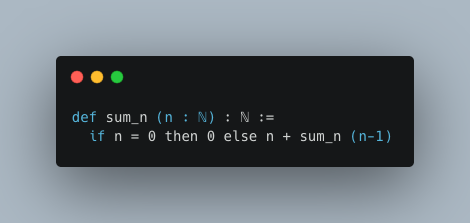

Introduction

Theorem proving is the process of formally verifying the correctness of mathematical propositions using logical deduction. In recent years, there has been a surge of interest in the development of computer-assisted theorem proving tools, which can aid mathematicians and computer scientists in verifying the correctness of complex mathematical proofs. One such tool is the Lean theorem prover, which is a powerful proof assistant developed at Microsoft Research. In this manuscript, we will provide an overview of the Lean theorem prover and its capabilities, and demonstrate how it can be used to prove mathematical theorems.

Overview of Lean Theorem Prover

The Lean theorem prover is a computer program that allows users to construct formal mathematical proofs using a type theory-based language. The language used in Lean is known as the Lean Programming Language (LPL), and it is similar in syntax and structure to other programming languages like Python or Haskell. However, unlike traditional programming languages, LPL is used to specify mathematical objects and their properties, as well as to construct formal proofs of mathematical propositions.

One of the key features of Lean is its support for dependent types, which allow types to depend on values. This feature is particularly useful for expressing mathematical concepts, as it allows users to specify precise conditions under which a given theorem holds. For example, one can define the type of all even natural numbers as a dependent type that depends on the value of an input natural number. This allows us to state the theorem that the sum of two even numbers is even in a precise and rigorous way.

Lean also comes equipped with a wide range of tactics and strategies for constructing and manipulating proofs. These tactics and strategies are designed to automate as much of the proof construction process as possible, allowing users to focus on the key insights and ideas required to construct a proof. Lean also has a powerful automated theorem prover, known as the Metamath Zero (MM0) backend, which can automatically prove many simple mathematical theorems.

Using Lean to Prove Theorems

To illustrate the use of Lean for theorem proving, let us consider the following simple theorem: the sum of the first n natural numbers is equal to n(n+1)/2. To prove this theorem in Lean, we first define the sum of the first n natural numbers using a recursive function as follows:

Next, we define the formula for the sum of the first n natural numbers as a function of n:

def sum_formula (n : ℕ) : ℕ := n*(n+1)/2

We can now state and prove our theorem using a Lean proof script:

theorem sum_of_naturals (n : ℕ) : sum_n n = sum_formula n :=
begin
  induction n with k hk,
  { refl },
  { simp [sum_n, sum_formula, hk],
    rw [←mul_add, nat.add_sub_cancel_left],
    ring }
end

In this proof script, we use the induction tactic to perform a proof by mathematical induction over the natural numbers. We then use the simp tactic to simplify the expressions on both sides of the equation, and the rw tactic to rewrite the expression on the left-hand side of the equation using the distributive property of multiplication over addition. Finally, we use the ring tactic to simplify the resulting expression using basic algebraic identities.

Conclusion

In this manuscript, we have provided an overview of the Lean theorem prover and its capabilities. We have shown how Lean can be used to construct formal mathematical proofs, using a simple example to illustrate the key features and tactics of Lean. The Lean ...
